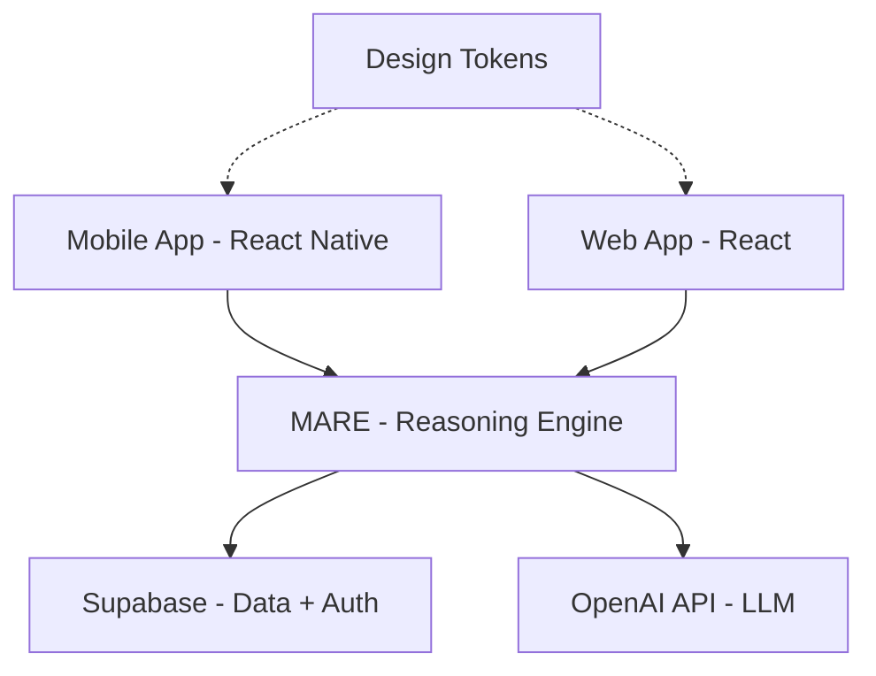

# Mentorium Architecture

## System Overview

## Core Components

### 1. Mobile App (`mentorium-app`)
The primary user interface for students. Built with Expo and React Native.
- Re-usable components.
- Auth flow with Supabase.
- Lesson viewer with inline Q&A powered by MARE.

### 2. Web App (`mentorium-web`)
A web-based prototype of the hallway and forum UI.
- Shares the same design language as mobile.
- Can be extended to use MARE for web-based tutoring.

### 3. MARE (`MARE`)
The "brain" of the system.
- **BKT Engine**: Tracks student mastery per skill using Bayesian Knowledge Tracing.
- **RAG Engine**: Handles lesson chunking and retrieval using Supabase Full Text Search and OpenAI.

### 4. Design Tokens (`packages/design-tokens`)
A shared library of primitive UI constants.
- Ensures visual consistency across platforms.
- Central point for theme updates.

## Data Flow
1. User interacts with a lesson or asks a question.
2. The App collects evidence (correct/incorrect) or the question text.
3. The App calls MARE's `mareUpdate` or `ragEngine.answerQuestion`.
4. MARE interacts with Supabase for state persistence or context retrieval.
5. MARE (if needed) calls OpenAI for high-level reasoning or text generation.
6. The result is returned to the App and rendered to the user.
